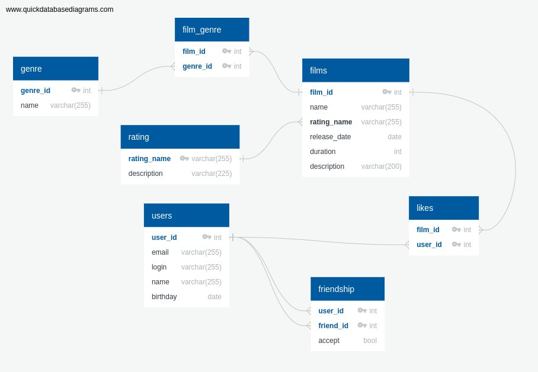

# java-filmorate


## Работа с пользователями
### Полученить список всех пользователей
GET /users
```roomsql
SELECT *
FROM users;
```

### Получить пользователя по id
GET /users/<id>
```roomsql
SELECT *
FROM users
WHERE user_id = id;
```

### Добавить пользователя
POST /users
```roomsql
INSERT INTO users
VALUES 
(id, email, login, name, TO_DATE(date, 'YYYY-MM-DD'));
```

### Обновить пользователя
PUT /users
```roomsql
UPDATE users
SET email = 'updated@mail.ru',
    login = 'updatedLogin',
    name = 'Обновленная Екатерина Ермолаева',
    birthday = TO_DATE('1992-12-16', 'YYYY-MM-DD')
WHERE user_id = 3;
```

### Добавить в друзья
PUt /users/{userId}/friends/{friendId}
```roomsql
INSERT INTO friendship
VALUES
(userId, friendId);
```

### Удаление из списка друзей
DELETE /users/{userId}/friends/{friendId}
```roomsql
DELETE FROM friendship
WHERE user_id = userId
     AND friend_id = friendId;
```

### Получить всех друзей пользователя
GET /users/{userId}/friends
```roomsql
SELECT u.user_id,
       u.email,
       u.login,
       u.name,
       u.birthday
FROM friendship AS f
INNER JOIN users AS u ON u.user_id = f.friend_id
WHERE f.user_id = userId AND f.accept = true
UNION
SELECT u.user_id,
       u.email,
       u.login,
       u.name,
       u.birthday
FROM friendship AS f
INNER JOIN users AS u ON u.user_id = f.user_id
WHERE f.friend_id = userId AND f.accept = true;
```

### Получить общих друзей
GET users/{userId}/friends/common/{friendId}
```roomsql
SELECT *
FROM (
    SELECT u.user_id,
           u.email,
           u.login,
           u.name,
           u.birthday
    FROM friendship AS f
    INNER JOIN users AS u ON u.user_id = f.friend_id
    WHERE f.user_id = userId AND f.accept = true
    UNION
    SELECT u.user_id,
           u.email,
           u.login,
           u.name,
           u.birthday
    FROM friendship AS f
    INNER JOIN users AS u ON u.user_id = f.user_id
    WHERE f.friend_id = userId AND f.accept = true
) AS t1

INTERSECT

SELECT *
FROM (
    SELECT u.user_id,
           u.email,
           u.login,
           u.name,
           u.birthday
    FROM friendship AS f
    INNER JOIN users AS u ON u.user_id = f.friend_id
    WHERE f.user_id = friendId AND f.accept = true
    UNION
    SELECT u.user_id,
           u.email,
           u.login,
           u.name,
           u.birthday
    FROM friendship AS f
    INNER JOIN users AS u ON u.user_id = f.user_id
    WHERE f.friend_id = friendId AND f.accept = true
) AS t2
```
## Работа с фильмами

### Получить все фильмы
GET films/
```roomsql
SELECT *
FROM films;
```

### Получить фильм по id
GET films/{filmId}
```roomsql
SELECT *
FROM films
WHERE film_id = filmId;
```

### Добавить фильм
POST films/
```roomsql
INSERT INTO films
VALUES
(2, 'Король Лев', 'G', TO_DATE('1994-06-12', 'YYYY-MM-DD'), 88, 'description');
```

### Обновить фильм
PUT films/
```roomsql
UPDATE films
SET name = 'updated name',
    rating_name = 'updatedRating',
    release_date  = TO_DATE('1995-06-12', 'YYYY-MM-DD'),
    duration = 84,
    description = 'updated description'
WHERE film_id = filmId;
```

### Добавить лайк фильму
PUT films/{filmId}/like/{userId}
```roomsql
INSERT INTO likes
VALUES
(filmId, userId);
```

### Удалить лайк у фильма
DELETE films/{filmId}/like/{userId}
```roomsql
DELETE FROM likes
WHERE film_id = filmId
     AND user_id = userId;
```

### Получить популярные фильмы
GET films/popular?count=5
```roomsql
SELECT COUNT(l.film_id) AS film_count,
       f.film_id,
       f.name,
       f.rating_name,
       f.release_date,
       f.duration,
       f.description
FROM likes AS l
INNER JOIN films AS f ON l.film_id = f.film_id
GROUP BY f.film_id
ORDER BY film_count DESC
LIMIT count;
```